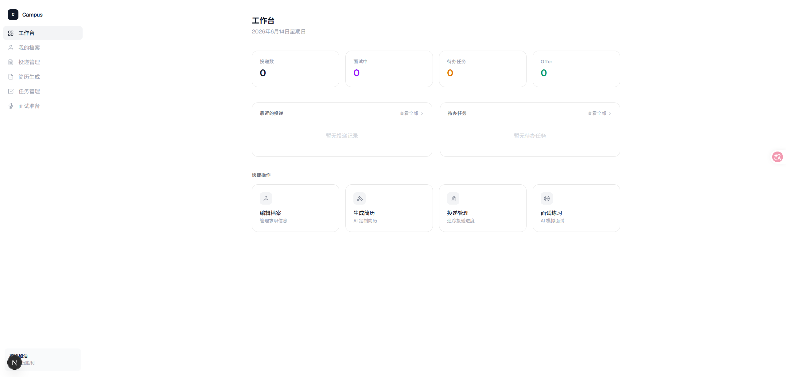
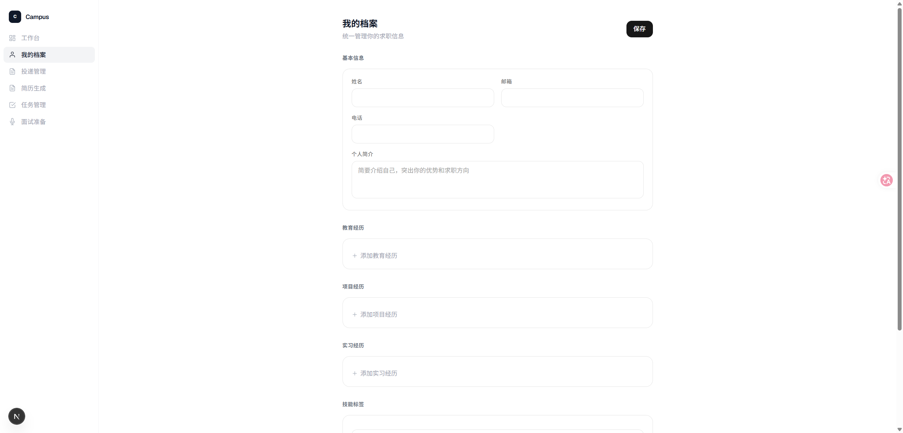
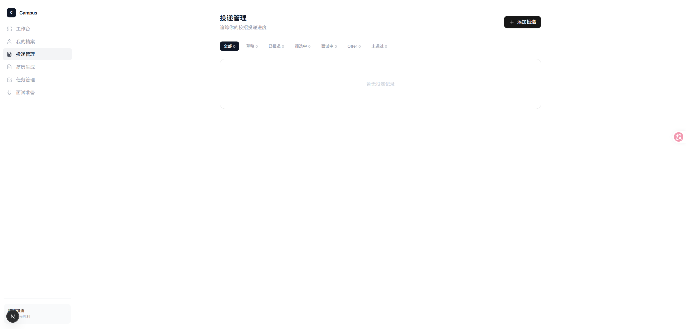
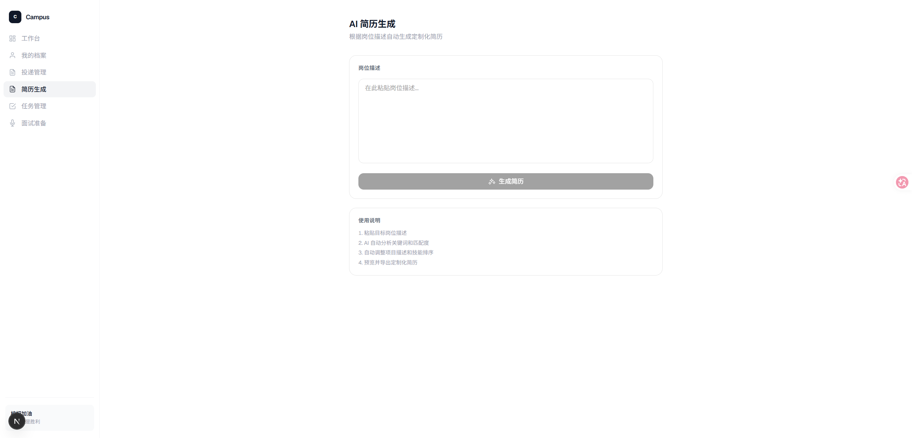
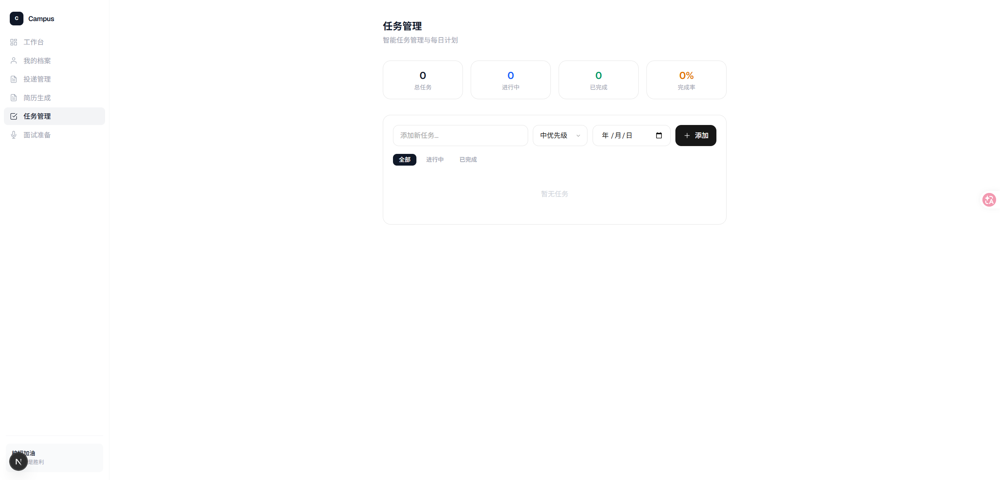
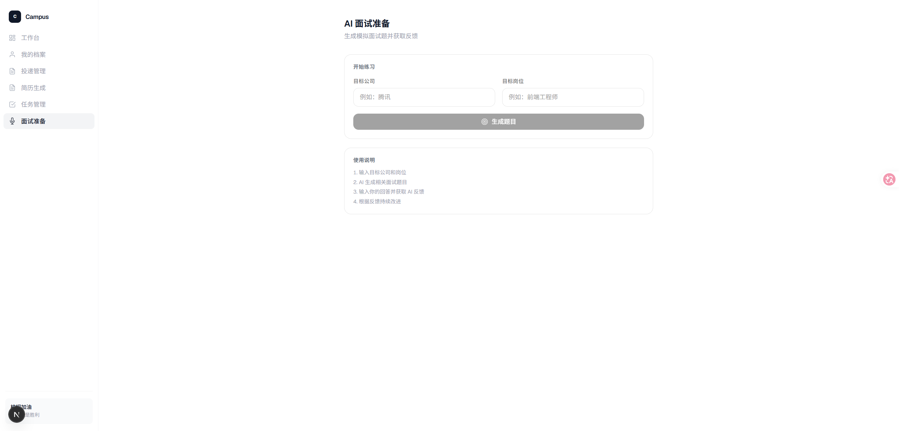

大家好，我们团队带来的作品是 Campus Copilot——一款专为应届毕业生打造的 AI 校招操作系统。

在校招季，很多同学都会遇到同样的问题：需要同时投递几十甚至上百家公司，每家公司都有不同的网申流程，需要反复填写个人信息、修改简历、记录截止时间，还要准备笔试和面试。整个过程繁琐、耗时，而且很容易遗漏重要节点，最终错失机会。

针对这些痛点，我们设计了 Campus Copilot，希望通过 AI 技术帮助应届生更加高效地完成整个求职过程。

产品的第一个核心亮点是 AI 网申助手（Application Agent）。用户只需要维护一份统一的求职档案，包括教育背景、项目经历、实习经历和技能信息，系统就可以根据不同企业和岗位要求，自动生成对应的网申内容和定制化简历，实现“一次填写，多次复用”，大幅减少重复劳动。

第二个核心亮点是 Time Agent 智能时间管理系统。它会自动管理所有企业的投递进度、网申截止日期、笔试安排、面试计划以及每日任务，帮助用户合理规划时间，避免因为遗忘或冲突而错过重要机会。同时，系统还提供校招作战看板，对所有申请状态进行统一可视化管理，让求职过程更加清晰、有序。

在技术架构方面，我们采用了 前端 + 后端 + 大模型 Agent 的整体设计。

前端负责构建用户交互界面，包括个人档案管理、校招作战看板以及任务管理等功能；后端负责用户数据、岗位信息、任务调度和业务逻辑处理；大模型部分则负责自然语言理解、简历优化、网申内容生成、岗位分析以及智能时间规划等 AI 能力，并通过多 Agent 协同完成复杂任务。

我们的目标不仅是打造一个 AI 简历工具，而是构建一个真正陪伴应届生完成整个校招周期的 AI 校招操作系统。希望借助人工智能技术，让每一位求职者都能更高效地管理时间、更轻松地完成网申，并获得更多理想的 Offer。

